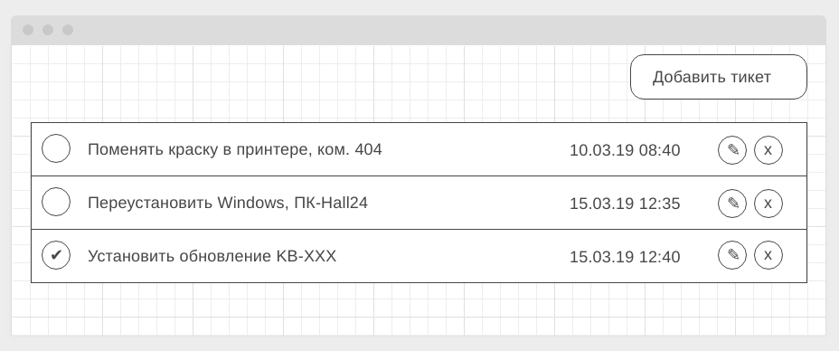
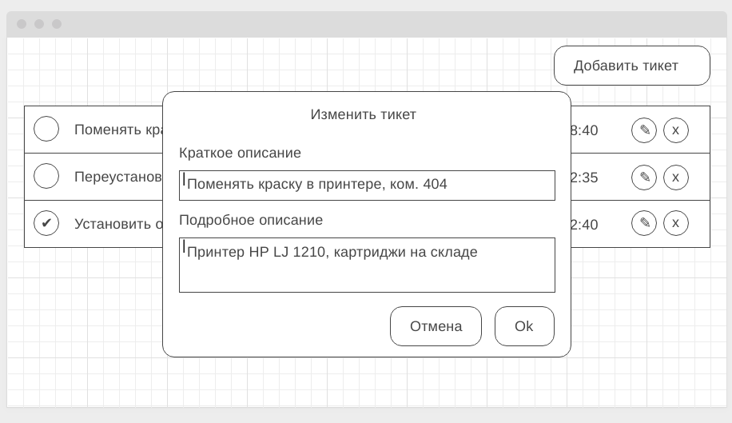

[GitHub Pages](https://lekseff.github.io/Tickets_Frontend/)

### HelpDesk: Frontend

#### Легенда

API вами написано, пора приступить к своим прямым обязанностям - написанию фронтенда, который будет с этим API работать.

#### Описание

Общий вид списка тикетов (должны загружаться с сервера в формате JSON):

Модальное окно добавления нового тикета (вызывается по кнопке "Добавить тикет" в правом верхнем углу):

Модальное окно редактирования существующего тикета (вызвается по кнопке с иконкой "✎" - карандашик):

Модальное окно подтверждения удаления (вызывается по кнопке с иконкой "x" - крестик):

Для просмотра деталей тикета нужно нажать на самом тикете (но не на контролах - сделано, редактировать или удалить):

В качестве бонуса можете отображать какую-нибудь иконку загрузки (см. https://loading.io) на время подгрузки.

Авто-тесты к данной задаче не требуются. Все данные и изменения должны браться/сохраняться на сервере, который вы написали в предыдущей задаче.

В качестве результата пришлите проверяющему ссылку на GitHub репозиторий.

P.S. Подгрузка подробного описания специально организована в виде отдельного запроса, мы прекрасно понимаем, что на малых объёмах информации нет смысла делать её отдельно.